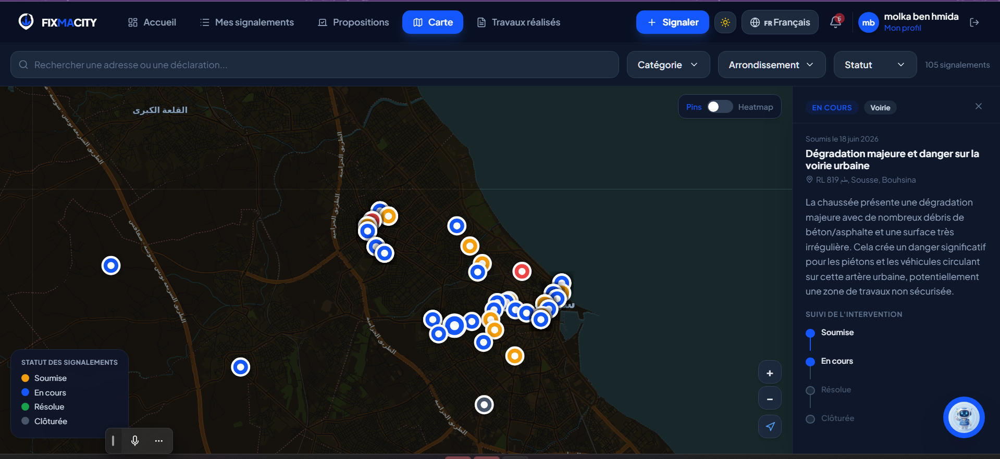
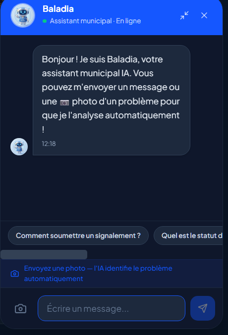
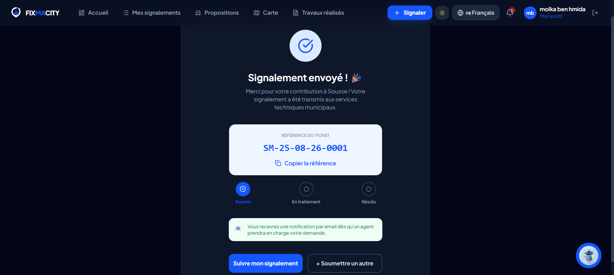

# FixMaCity 

Citizen request management platform for the Municipality of Sousse, Tunisia.

## À propos

FixMaCity permet aux citoyens de signaler des problèmes urbains (voirie, éclairage, propreté, assainissement...) directement en ligne, avec un suivi transparent jusqu'à résolution. Le projet centralise un processus auparavant manuel, à travers une plateforme multi-rôles (citoyen, agent, chef de service, président) et un assistant IA qui analyse les photos soumises et remplit automatiquement les champs du signalement.

## Fonctionnalités clés

- 🗺️ **Carte interactive** — visualisation en temps réel de tous les signalements par catégorie et statut
- 🤖 **Assistant IA (Baladia)** — chatbot intégré qui répond aux questions des citoyens et analyse les photos soumises pour pré-remplir automatiquement les signalements
- 👥 **Multi-rôles** — interfaces dédiées pour citoyens, agents, chefs de service et président
- 🗳️ **Propositions citoyennes** — système de vote sur les projets municipaux proposés

## Aperçu

**Vue citoyenne — carte interactive des signalements en temps réel**

**Signalement assisté par IA — remplissage automatique depuis une photo**

**Assistant municipal IA — Baladia répond aux questions et guide les citoyens**

**Confirmation après soumission**

## Architecture

- **Frontend**: React + Vite ([README](fixmacity-frontend/README.md))
- **Backend**: Node.js + Express ([README](fixmacity-backend/FIXMACITY_BACKEND.md))

## Quick Start

1. Install dependencies: `npm run install:all`
2. Set up backend `.env` from `.env.example`
3. Start backend: `npm run dev:backend`
4. Start frontend: `npm run dev:frontend`
